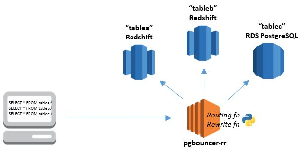
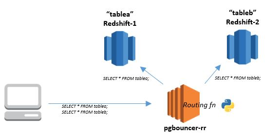
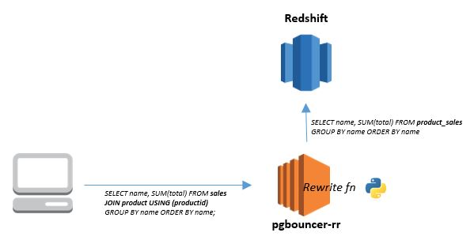

# Query Routing and Rewrite: Introducing pgbouncer-rr for Amazon Redshift and PostgreSQL

Have you ever wanted to split your database load across multiple servers or clusters without impacting the configuration or code of your client applications? Or perhaps you have wished for a way to intercept and modify application queries, so that you can make them use optimized tables (sorted, pre-joined, pre-aggregated, etc.), add security filters, or hide changes you have made in the schema?  

The [pgbouncer-rr](https://github.com/awslabs/pgbouncer-rr-patch) project is based on [pgbouncer](https://pgbouncer.github.io/usage.html#description), an open source PostgreSQL connection pooler. It adds two new significant features:    
1. **Routing:** intelligently send queries to different database servers from one client connection; use it to partition or load balance across multiple servers/clusters.  
2. **Rewrite:** intercept and programmatically change client queries before they are sent to the server: use it to optimize or otherwise alter queries without modifying your application.   



Pgbouncer-rr works the same way as pgbouncer; any target application can be connected to pgbouncer-rr as if it were an Amazon Redshift or PostgreSQL server, and pgbouncer-rr creates a connection to the actual server, or reuses an existing connection.  

You can elect to deploy multiple instances of pgbouncer-rr to avoid throughput bottlenecks or single points of failure, or to support multiple configurations. It can live in an Auto Scaling group, and behind an Elastic Load Balancing load balancer. It can be deployed to a public subnet while your servers reside in private subnets. You can choose to run it as a bastion server using SSH tunneling, or you can use pgbouncer's recently introduced SSL support for encryption and authentication.  

Documentation and community support for pgbouncer can be easily found [online](https://pgbouncer.github.io/usage.html#description);  pgbouncer-rr is a superset of pgbouncer.  

Now I’d like to talk about the query routing and query rewrite feature enhancements.

## Query Routing

The routing feature maps client connections to server connections using a Python routing function which you provide. Your function is called for each query, with the client username and the query string as parameters. Its return value must identify the target database server; how it does this is entirely up to you.  

For example, you might want to run two Amazon Redshift clusters, each optimized to host a distinct data warehouse subject area. You can determine the appropriate cluster for any given query based on the names of the schemas or tables used in the query. This can be extended to support multiple Amazon Redshift clusters or PostgreSQL instances.  

In fact, you can even mix and match Amazon Redshift and PostgreSQL, taking care to ensure that your Python functions correctly handle any server-specific grammar in your queries; your database will throw errors if your routing function sends queries it can’t process. And, of course, any query must run entirely on the server to which it is routed; cross-database joins or multi-server transactions do not work!  

Here’s another example: you might want to implement controlled load balancing (or A/B testing) across replicated clusters or servers. Your routing function can choose a server for each query based on any combination of the client username, the query string, random variables, or external input. The logic can be as simple or as sophisticated as you want.  

Your routing function has access to the full power of the python language and the myriad of available Python modules. You can use the regular expression module ([re](https://docs.python.org/2/library/re.html)) to match words and patterns in the query string, or use the SQL parser module ([sqlparse](https://pypi.python.org/pypi/sqlparse)) to support more sophisticated/robust query parsing. You may also want to use the AWS SDK module ([boto](https://aws.amazon.com/sdk-for-python/)) to read your routing table configurations from Amazon DynamoDB.
   
The Python routing function is dynamically loaded by pgbouncer-rr, from the file you specify in the configuration:  
`routing_rules_py_module_file = /etc/pgbouncer-rr/routing_rules.py`

The file should contain the following Python function:    
`def routing_rules(username, query):`  
- The function parameters will provide the username associated with the client, and a query string.
- The function return value must be a valid database key name (dbkey) as specified in the configuration file, or `None`:
  - When a valid dbkey is returned by the routing function, the client connection will be routed to a connection in the specified server connection pool. 
  - When `None` is returned by the routing function, the client remains routed to its current server connection.   

The route function is called only for query and prepare packets, with the following restrictions: 

- All queries must run wholly on the assigned server; cross-server joins do not work  
- Ideally queries should autocommit each statement. Set `pool_mode = statement` in the configuration.
- Multi-statement transactions will work correctly only if statements are not rerouted by the routing_rules function to a different server pool mid-transaction. Set `pool_mode = transaction` in the configuration.
- If your application uses database catalog tables to discover the schema, then the routing_rules function should direct catalog table queries to a database server that has all the relevant schema objects created.   


#### Simple Query Routing Example
 
Amazon Redshift cluster 1 has data in table 'tablea'. Amazon Redshift cluster 2 has data in table 'tableb'. You want a client to be able to issue queries against either tablea or tableb without needing to know which table resides on which cluster.  

Create a (default) entry with a key, say, 'dev' in the [databases] section of the pgbouncer configuration. This entry determines the default cluster used for client connections to database 'dev'. You can make either redshift1 or redshift2 the default, or even specify a third 'default' cluster. Create additional entries in the pgbouncer [databases] section for each cluster; give these unique key names such as 'dev.1', and 'dev.2'.  

```
[databases]
dev = host=<redshift1> port=5439 dbname=dev
dev.1 = host=<redshift1> port=5439 dbname=dev
dev.2 = host=<redshift2> port=5439 dbname=dev
```
Ensure the configuration file setting `routing_rules_py_module_file` specifies the path to your python routing function file, such as `~/routing_rules.py`.
 
The code in the file could look like the following:
```
def routing_rules(username, query):
	if "tablea" in query:
		return "dev.1"
	elif "tableb" in query:
		return "dev.2"
	else:
		return None
```


This is a toy example, but it illustrates the concept.  
If a client sends the query SELECT * FROM tablea, it matches the first rule, and is assigned to server pool 'dev.1' (redshift1).  
If a client (and it could be the same client in the same session) sends the query SELECT * FROM tableb, it matches the second rule, and is assigned to server pool 'dev.2' (redshift2). Any query that does not match either rule results in None being returned, and the server connection remains unchanged.  

Here is an alternative function for the same use case, but the routing logic is defined in a separate extensible data structure using regular expressions to find the table matches. The routing table structure could easily be externalized in a DynamoDB table.  
```
# ROUTING TABLE
# ensure all dbkey values are defined in [database] section of the pgbouncer ini file 
routingtable = {
	'route' : [{
			'usernameRegex' : '.*',
			'queryRegex' : '.*tablea.*',
			'dbkey' : 'dev.1'
		}, {
			'usernameRegex' : '.*',
			'queryRegex' : '.*tableb.*',
			'dbkey' : 'dev.2'
		}
	],
	'default' : None
}

# ROUTING FN - CALLED FROM PGBOUNCER-RR - DO NOT CHANGE NAME
# IMPLEMENTS REGEX RULES DEFINED IN ROUTINGTABLE OBJECT
# RETURNS FIRST MATCH FOUND
import re
def routing_rules(username, query):
	for route in routingtable['route']:
		u = re.compile(route['usernameRegex'])
		q = re.compile(route['queryRegex'])
		if u.search(username) and q.search(query):
			return route['dbkey']
	return routingtable['default']
```

You will most likely want to implement more robust and sophisticated rules, taking care to avoid unintended matches. Write test cases to call your function with different inputs and validate the output dbkey values.  


## Query Rewrite

The rewrite feature provides the opportunity to manipulate application queries en route to the server, without modifying application code. You might want to do this to:
 - Optimize an incoming query to use the best physical tables, when you have: 
   - Replicated tables with alternative sort/dist keys and column subsets (*emulate projections*).
   - Stored pre-joined or pre-aggregated data (*emulate 'materialized views'*)
 - Apply query filters to support row level data partitioning/security
 - Roll out new schemas, resolve naming conflicts and the like, by changing identifier names on the fly.
 
The rewrite function is also implemented in a fully configurable python function, dynamically loaded from an external module specified in the configuration:
`rewrite_query_py_module_file = /etc/pgbouncer-rr/rewrite_query.py`

The file should contain the python function:    
`def rewrite_query(username, query):`  
- The function parameters will provide the username associated with the client, and a query string.
- The function return value must be a valid SQL query string which will return the result set you want the client application to receive. 
  
Implementing a query rewrite function is straightforward when the incoming application queries have fixed formats that are easily detectable and easily manipulated, perhaps using regular expression search/replace logic in the Python function. It is much more challenging to build a robust rewrite function to handle SQL statements with arbitrary format and complexity.  

Enabling the query rewrite function triggers pgbouncer-rr to enforce that a complete query is contained in the incoming client socket buffer. Long queries are often split across multiple network packets; they should all be in the buffer before the rewrite function is called. This requires that the buffer size be large enough to accommodate the largest query. The default buffer size (2048) is likely too small, so specify a much larger size in the configuration: `pkt_buf = 32768`  

If a partially received query is detected, and there is room in the buffer for the remainder of the query, pgbouncer-rr waits for the remaining packets to be received before processing the query. If the buffer is not large enough for the incoming query, or if it is not large enough to hold the re-written query (which may be longer than the original), then the rewrite function will fail. By default, the failure is logged, and the original query string will be passed to the server unchanged. You can force the client connection to terminate instead, by setting:  `rewrite_query_disconnect_on_failure = true`.  

 
#### Simple Query Rewrite Example

Scenario:  
You have a star schema with a large fact table in Redshift (say, 'sales') with two related dimension tables (say 'store' and 'product'). You want to optimize equally for two different queries:
```
1> SELECT storename, SUM(total) FROM sales JOIN store USING (storeid) GROUP BY storename ORDER BY storename
2> SELECT prodname, SUM(total) FROM sales JOIN product USING (productid) GROUP BY prodname ORDER BY prodname
```
By experimenting, you have determined that the best possible solution is to have two additional tables, each optimized for one of the queries:  
1. store_sales: store and sales tables denormalized, pre-aggregated by store, and sorted and distributed by store name.  
2. product_sales: product and sales tables denormalized, pre-aggregated by product, sorted and distributed by product name.  

So you implement the new tables, and take care of their population in your ETL processes. 
But, you'd like to avoid directly exposing these new tables to your reporting or analytic client applications. This might be the best optimization today, but who knows what the future holds? Maybe you'll come up with a better optimization later, or maybe Redshift will introduce cool new features that provide a simpler alternative.

So, you implement a pgbouncer-rr rewrite function to change the original queries on the fly.

Ensure the configuration file setting `rewrite_query_py_module_file` specifies the path to your python function file, say `~/rewrite_query.py`.

The code in the file could look like this:
```
import re
def rewrite_query(username, query):
    q1="SELECT storename, SUM\(total\) FROM sales JOIN store USING \(storeid\) GROUP BY storename ORDER BY storename"
    q2="SELECT prodname, SUM\(total\) FROM sales JOIN product USING \(productid\) GROUP BY prodname ORDER BY prodname"
    if re.match(q1, query):
        new_query = "SELECT storename, SUM(total) FROM store_sales GROUP BY storename ORDER BY storename;"
    elif re.match(q2, query):
        new_query = "SELECT prodname, SUM(total) FROM product_sales GROUP BY prodname ORDER BY prodname;"
    else:
        new_query = query
    return new_query
```



Again, this is a toy example to illustrate the concept. In any real application, your python function will need to employ more robust query pattern matching and substitution.  

Your reports and client applications use the same join query as before:  
```
SELECT prodname, SUM(total) FROM sales JOIN product USING (productid) GROUP BY prodname ORDER BY prodname;
```
But now, when you look in the Redshift console 'Queries' tab, you will see that the  query received by Redshift is the rewritten version that uses the new product_sales table - leveraging your pre-joined, pre-aggregated data and the targeted sort and dist keys:
```
SELECT prodname, SUM(total) FROM product_sales GROUP BY prodname ORDER BY prodname;
```

# Getting Started

**Install**  
Download and install pgbouncer-rr by running the following commands (Amazon Linux/RHEL/CentOS):
```
# install required packages
sudo yum install libevent-devel openssl-devel python-devel libtool git patch make -y

# download the latest pgbouncer distribution
git clone https://github.com/pgbouncer/pgbouncer.git

# download pgbouncer-rr extensions
git clone https://github.com/awslabs/pgbouncer-rr-patch.git

# merge pgbouncer-rr extensions into pgbouncer code
cd pgbouncer-rr-patch
./install-pgbouncer-rr-patch.sh ../pgbouncer

# build and install
cd ../pgbouncer
git submodule init
git submodule update
./autogen.sh
./configure ...
make
sudo make install
``` 

**Configure**  
Create a configuration file, using `./pgbouncer-example.ini` as a starting point, adding your own database connections and python routing rules / rewrite query functions.  

Set up user authentication - see [authentication file format](https://pgbouncer.github.io/config.html#authentication-file-format). NOTE: the recently added pgbouncer `auth_query` feature will unfortunately not work with Amazon Redshift.  

By default, pgbouncer-rr does not support SSL/TLS connections. However, you can experiment with pgbouncer's newest [TLS/SSL feature](https://github.com/pgbouncer/pgbouncer/blob/master/doc/config.rst#tls-settings). Just add a private key and certificate to your pgbouncer-rr configuration:
```
client_tls_sslmode=allow
client_tls_key_file = ./pgbouncer-rr-key.key
client_tls_cert_file = ./pgbouncer-rr-key.crt
```
Hint: Here's how to easily generate a test key with a self-signed certificate using openssl:
```
openssl req -newkey rsa:2048 -nodes -keyout pgbouncer-rr-key.key -x509 -days 365 -out pgbouncer-rr-key.crt
```
  
**Configure firewall**  
Configure your linux firewall to enable incoming connections on the configured pgbouncer-rr listening port. Example:
```
sudo firewall-cmd --zone=public --add-port=5439/tcp --permanent
sudo firewall-cmd --reload
```
If you are running pgbouncer-rr on an Amazon EC2 instance, the instance Security Group must also be configured to allow incoming TCP connections on the listening port.  
  
**Launch**  
Run pgbouncer-rr as a daemon using the commandline `pgbouncer <config_file> -d`.   
See `pgbouncer --help` for commandline options. _Hint: use `-v` to enable verbose logging. If you look carefully in the logfile you will see evidence of the query routing and query rewrite features in action._  

**Connect**  
Configure your client application as though you were connecting directly to a Redshift or PostgreSQL database, but be sure to use the pgbouncer-rr hostname and listening port.  
Example – using psql   
```
psql -h pgbouncer-dnshostname -U dbuser -d dev -p 5439
```
Example – JDBC driver URL (Redshift driver)
```
jdbc:redshift://pgbouncer-dnshostname:5439/dev
```
   
# Other uses for pgbouncer-rr

It can be used for lots of things, really. In addition to the examples shown above, here are some other use cases suggested by colleagues:  

- Serve small or repetitive queries from PostgreSQL tables consisting of aggregated results.  
- Parse SQL for job tracking tablenames to implement workload management with job tracking tables on PostgreSQL, simplifies application development.  
- Leverage multiple Redshift clusters to serve dashboarding workloads with heavy concurrency requirements.  
  - _determine the appropriate route based on the current workload/state of cluster resources (always route to the cluster with least running queries, etc)._
- Use Query rewrite to parse SQL for queries which do not leverage the nuances of Redshift query design or query best practices either block these queries or re-write them for performance.  
- Use SQL parse to limit end users ability to access tables with adhoc queries. e.g. identify users scanning N+ years of data and instead issue a query which blocks them with a re-write: SELECT 'WARNING: scans against v_all_sales must be limited to no more than 30 days' as alert;  
- Use SQL parse to identify queries which filter on certain criteria to re-write the query to direct the query towards a specific table containing data matching that filter.  

Actually, your use cases don't need to be limited to just routing and query rewriting! You could design a routing function that leaves the route unchanged, but which instead implements purposeful side effects, such as:  
- Publish custom CloudWatch metrics, enabling you to monitor specific query patterns and/or user interactions with your database(s).  
- Capture SQL DDL and COPY/Write Statements and wrap them into Kinesis `put-records` as input to the method described in Erik Swensson's most excellent post: [Building Multi-AZ or Multi-Region Amazon Redshift Clusters](https://blogs.aws.amazon.com/bigdata/post/Tx13ZDHZANSX9UX/Building-Multi-AZ-or-Multi-Region-Amazon-Redshift-Clusters)  

We'd love to hear your thoughts and ideas for pgbouncer-rr functions.    


# Legal Notice

Copyright 2015-2015 Amazon.com, Inc. or its affiliates. All Rights Reserved.

Licensed under the Amazon Software License (the "License"). You may not use this file except in compliance with the License. A copy of the License is located at http://aws.amazon.com/asl/ or in the "license" file accompanying this file. This file is distributed on an "AS IS" BASIS, WITHOUT WARRANTIES OR CONDITIONS OF ANY KIND, express or implied. See the License for the specific language governing permissions and limitations under the License.

